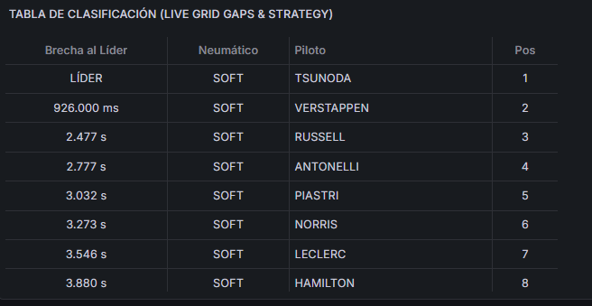
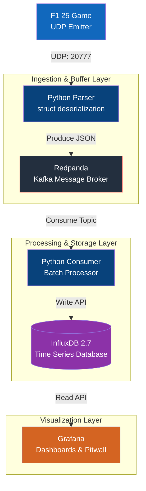

<div align="center">
  <h1>🏎️ F1 Telemetry Pipeline 📊</h1>
  <p><strong>Un pipeline de datos de alto rendimiento y tiempo real para Fórmula 1 (Codemasters F1 25)</strong></p>
  
  [](https://www.python.org/)
  [](https://redpanda.com/)
  [](https://www.influxdata.com/)
  [](https://grafana.com/)
  [](https://www.docker.com/)

</div>

---

Bienvenido al repositorio oficial del **F1 Telemetry Pipeline**. Este proyecto captura los paquetes de red crudos del videojuego F1 25 y los transforma en un espectacular "Muro de Ingeniero" en vivo a través de un backend asíncrono y robusto.



## 📖 Documentación

Hemos estructurado toda la documentación técnica siguiendo el [Framework Diátaxis](https://diataxis.fr/), dividiendo el contenido según el propósito de tu visita:

### 🚀 Para Usuarios (Despliegue)
- 🎓 **[Tutorial: Despliegue Rápido](docs/tutorials/despliegue-rapido.md)** - Inicia el proyecto de 0 a 100 en menos de 10 minutos (Docker, F1 25, Grafana).
- 🎓 **[Tutorial Avanzado: Escalabilidad y WebSockets](docs/tutorials/escalabilidad-websockets.md)** - Cómo escalar el pipeline para conectar frontends en tiempo real.
- 🎯 **[Guía: Cómo crear Dashboards Avanzados con Flux](docs/how-to/crear-dashboards-flux.md)** - Consultas avanzadas, derivadas y variables de entorno.
- 🎯 **[Guía: Análisis Histórico Post-Carrera](docs/how-to/analisis-historico.md)** - Cómo separar y analizar datos de distintas sesiones de forma independiente.
- 🧠 **[Explicación: Troubleshooting y Operaciones](docs/explanation/troubleshooting-operaciones.md)** - Guía de resolución de problemas (UDP, OOM Kills, disco).

### 🛠️ Para Desarrolladores (Extensión y Contribución)
- 🎯 **[Guía: Cómo agregar nueva telemetría](docs/how-to/agregar-telemetria.md)** - Pasos para interceptar nuevos paquetes UDP (Ej: Daños, Ruedas pinchadas) e inyectarlos.
- 📚 **[Referencia: Diccionario de Datos](docs/reference/diccionario-de-datos.md)** - Tablas con la equivalencia de cabeceras, tópicos de Kafka y el modelo Time-Series.
- 📚 **[Referencia: Arquitectura del Código Fuente](docs/reference/arquitectura-codigo.md)** - Estructura interna de los servicios de Python y sus dependencias.
- 🧠 **[Explicación: Arquitectura Profunda](docs/explanation/arquitectura-profunda.md)** - Explicación de por qué usamos Redpanda como buffer intermedio y el _struct parser_.

## 🏗️ Arquitectura General

El sistema se compone de múltiples contenedores desacoplados para máxima eficiencia:



> [!NOTE]
> Puedes encontrar diagramas visuales más avanzados y detallados generados con Excalidraw en la carpeta [`docs/diagramas/`](docs/diagramas/). Podrás ver el flujo de la red, los esquemas de bases de datos y la secuencia del parser.

## 🏁 Inicio Rápido (TL;DR)

Si solo quieres verlo funcionar ya mismo:

```bash
docker compose up -d --build
```

Luego entra a [http://localhost:3000](http://localhost:3000) (Usuario: `admin`, Clave: `admin`) y abre el **Muro del Ingeniero**. Asegúrate de que el juego está enviando telemetría al puerto UDP 20777 (Ver [Tutorial](docs/tutorials/despliegue-rapido.md)).

---
*Diseñado para maximizar la visibilidad en pista de tu escudería.*
