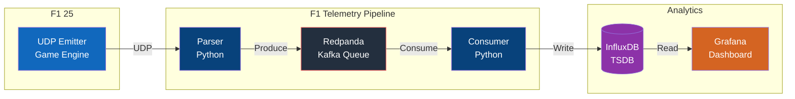
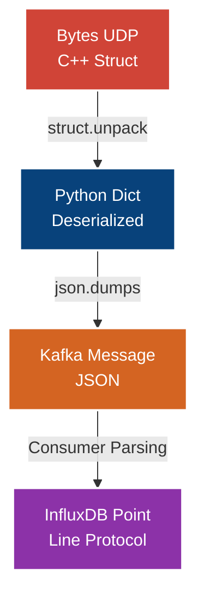

# Explicación: Arquitectura Profunda del Sistema

> [!NOTE]
> Este documento explica el "por qué" detrás del diseño arquitectónico del F1 Telemetry Pipeline. No contiene instrucciones de uso, sino la racionalización de las decisiones técnicas.

## 1. El Problema de la Telemetría UDP

El motor de física de Codemasters (F1 25) exporta telemetría cruda mediante el protocolo UDP. La naturaleza de UDP es _"fire and forget"_ (disparar y olvidar); no garantiza la entrega ni el orden.

Además, a máxima tasa (120Hz), el juego puede inyectar hasta **20,000+ paquetes por minuto** en la red local.

Procesar estos paquetes uno a uno e insertarlos directamente en una base de datos resultaría en:
1. Cuellos de botella severos por el overhead de operaciones de red (Input/Output).
2. Pérdida masiva de datos temporales.
3. Sobrecargas por CPU en la transformación de bytes crudos (`C++ Structs`).

## 2. La Solución: Separación de Responsabilidades y un Buffer Intermedio

Para abordar la escalabilidad, la arquitectura introduce un **Message Broker (Redpanda)**.

### 2.1 El Ingestor (Parser)
El **Parser de Python** tiene una única responsabilidad: Deserializar a la mayor velocidad posible y enviar al Buffer.

- **Por qué `struct`**: En lugar de librerías costosas, usamos el módulo nativo de C `struct` de Python (`<Hfff...`). Es extremadamente rápido porque delega la descompresión a bajo nivel.
- Solo produce JSON y lo inyecta a un Tópico de Kafka asociado (Ej: `f1-telemetry-fast`).

### 2.2 El Buffer Central (Redpanda)
Hemos optado por **Redpanda** en lugar de Apache Kafka por dos motivos críticos:
1. **Sin Zookeeper / JVM**: Kafka depende de Java (JVM) y un cluster Zookeeper (o KRaft) que consume muchísimos gigabytes de RAM. Redpanda está escrito en C++ y compila estáticamente. Ofrece la API de Kafka siendo mucho más ligero.
2. Permite que el Parser publique asincrónicamente y libere el hilo del socket, por lo que no se pierden nuevos paquetes UDP.

### 2.3 El Procesador Final (Consumer)
El **Consumer de Python** vive a su propio ritmo. Escucha los tópicos de Redpanda. Si InfluxDB se queda atrás, los mensajes simplemente se encolan en Redpanda.
- **Batching Nativo**: Recibe grandes listas de JSON y agrupa los puntos (`Point`) en InfluxDB.
- Se hace una conversión de unidades (Ej: milisegundos a segundos para el Sector 1 y 2, para estandarizar las queries de Grafana).

## 3. InfluxDB sobre SQL Relacional

La telemetría de un auto a 300km/h genera métricas de series de tiempo (Time-Series).
Usar PostgreSQL o MySQL para insertar cientos de RPMs por segundo generaría indexaciones inmanejables. **InfluxDB** está optimizado con motores de almacenamiento de bloques columnares que asimilan este tipo de ráfagas casi sin inmutarse, agrupándolas eficientemente gracias al Line Protocol.
