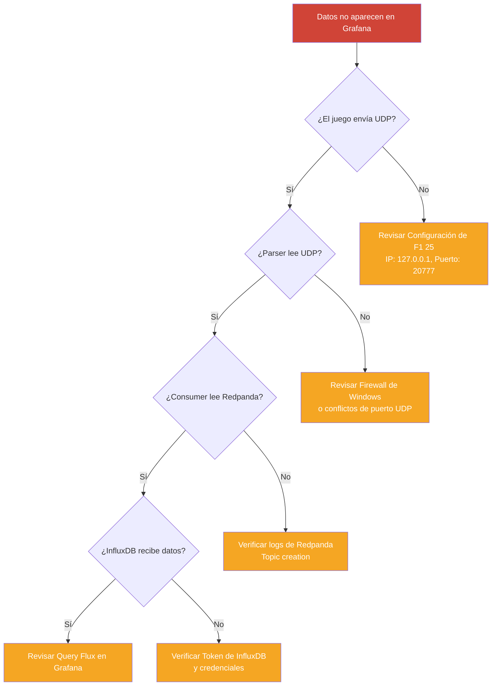

# Explicación: Troubleshooting y Operaciones (DevOps)

> [!WARNING]
> Correr un pipeline de ingesta a 120Hz (más de 20,000 paquetes por minuto) trae desafíos únicos a nivel de red y memoria. Este documento explica cómo identificar y mitigar problemas operacionales comunes.

## Árbol de Decisión Rápida

Si los datos no llegan al Muro de Ingeniero en Grafana, sigue este flujo para identificar el punto de fallo:



## Problema 1: El Firewall de Windows bloqueando UDP

### El por qué
A diferencia de TCP, el protocolo UDP no tiene un mecanismo de *handshake*. Si el Firewall de Windows Defender decide que el tráfico entrante al puerto `20777` desde un proceso local (el motor del juego F1) hacia un entorno Docker no está explícitamente permitido, descartará los paquetes silenciosamente. 

### Síntomas
- El juego indica que está enviando telemetría.
- Los logs del contenedor `f1-parser` están vacíos o atascados en `Listening on 0.0.0.0:20777`.

### Solución
Debes crear una regla de entrada (*Inbound Rule*) explícita en Windows Defender para permitir el tráfico UDP en el puerto `20777`, o asegurarte de que Docker Desktop tenga permisos de red en redes privadas.

## Problema 2: Out Of Memory (OOM) Kills

### El por qué
Docker Desktop en Windows (a través de WSL2) asigna dinámicamente memoria a los contenedores. Si no pones límites, InfluxDB (para indexación) y Redpanda pueden intentar cachear todo en RAM. Si agotan la RAM asignada a WSL2, Linux invocará al `OOM Killer` y matará el contenedor silenciosamente.

### Síntomas
- El dashboard de Grafana muestra cortes intermitentes (`No Data`).
- `docker ps` muestra que los contenedores se reiniciaron (`Restarting (137) 5 seconds ago`). El código de salida `137` indica OOM.

### Solución
Redpanda se arranca con el flag `--overprovisioned` en este proyecto para indicarle que comparta la RAM con otros servicios. Si el problema persiste en equipos limitados, debes agregar límites estrictos en `docker-compose.yml`:
```yaml
deploy:
  resources:
    limits:
      memory: 1G
```

## Problema 3: Disco Lleno por Retención Infinita

### El por qué
Redpanda (al ser compatible con Kafka) almacena todos los mensajes en un log append-only. Por defecto, su retención puede ser infinita o de 7 días. A 120Hz, una hora de carrera genera megabytes de archivos log en el volumen `./data/redpanda`.

InfluxDB también almacena métricas con retención infinita si no se configura un `retention policy`.

### Solución
- **Para Redpanda**: En producción real, se configura la propiedad `retention.ms` (ej. 3600000 para 1 hora) o `retention.bytes` por tópico. Ya que Redpanda solo funciona como *buffer efímero* aquí, no tiene sentido almacenar telemetría por días.
- **Para InfluxDB**: Crear tareas automáticas para hacer *downsampling* (promediar datos de 120Hz a 1Hz) de sesiones antiguas y borrar los datos crudos del bucket `f1_telemetry_raw` después de 30 días.
