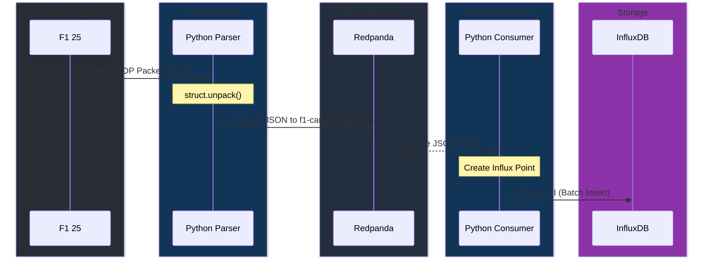

# Cómo Agregar Nueva Telemetría (Nuevos Paquetes)

> [!TIP]
> Esta guía asume que ya tienes el proyecto levantado. Te mostraremos cómo extender el pipeline para soportar un nuevo paquete del juego, por ejemplo: los datos de daños (`Car Damage Packet`, packet_id = 10).

El proceso consta de 3 pasos: interceptarlo en el Parser, agregarlo a los tópicos, e ingerirlo en el Consumer.



## Paso 1: Configurar el formato en el Parser

Abre el archivo `parser/src/main.py`.

1. **Investiga el struct**: Según la documentación oficial de F1, cada paquete tiene una estructura de bytes definida. Busca el tamaño y los tipos de dato (ej. `<B` para un byte, `<f` para float).
2. **Declara la constante**:
   ```python
   DAMAGE_CAR_FORMAT = "<fBBB" # Ejemplo imaginario
   DAMAGE_CAR_SIZE = struct.calcsize(DAMAGE_CAR_FORMAT)
   ```
3. **Agrega el Topic Mapping**:
   En el diccionario `TOPIC_MAPPING`, asocia el ID del paquete al nombre que tendrá en Redpanda:
   ```python
   TOPIC_MAPPING = {
       ...
       10: "f1-car-damage",
       ...
   }
   ```

## Paso 2: Crear la función de parseo

En el mismo `parser/src/main.py`, crea una función `parse_damage_packet(data)` siguiendo el patrón existente:

```python
def parse_damage_packet(data):
    cars = []
    offset = HEADER_SIZE
    for i in range(22):
        try:
            unpacked = struct.unpack_from(DAMAGE_CAR_FORMAT, data, offset)
            if i in DRIVER_MAP:
                cars.append({
                    "car_idx": i,
                    "driver_name": DRIVER_MAP[i],
                    "front_left_wing_damage": unpacked[0],
                    "engine_damage": unpacked[1],
                })
            offset += DAMAGE_CAR_SIZE
        except: break
    return cars
```

Agrégalo en el `main()`:
```python
elif packet_id == 10: payload["cars"] = parse_damage_packet(data)
```

## Paso 3: Consumirlo en InfluxDB

Abre `consumer/src/main.py`.

1. **Suscríbete al tópico**: Agrega `"f1-car-damage"` a la lista de `TOPICS`.
2. **Crea el Point Influx**:
   Busca el loop de procesado y agrega la condición para el paquete 10:
   ```python
   elif packet_id == 10:
       point = Point("car_damage")\
           .tag("session_uid", session_uid)\
           .tag("driver_name", driver_name)\
           .field("fl_wing_damage", float(car["front_left_wing_damage"]))\
           .field("engine_damage", float(car["engine_damage"]))
       points_batch.append(point)
   ```

## Paso 4: Reiniciar los Servicios

Para que los cambios de Python surtan efecto, debes reconstruir las imágenes de Docker.

```bash
docker compose up -d --build
```

Ahora el paquete de daños fluirá hasta tu bucket de InfluxDB y podrás usarlo para crear nuevos paneles en Grafana.
