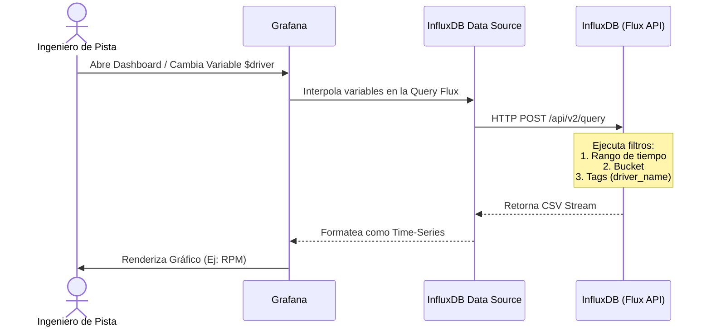

# Cómo crear Dashboards Avanzados con Flux

> [!TIP]
> InfluxDB 2.x introdujo **Flux** como lenguaje funcional para consultar series de tiempo. Reemplaza a InfluxQL. Esta guía te enseña a crear consultas específicas para exprimir la telemetría del F1 25.

## El Flujo de Ejecución de Grafana



## 1. Configurar Variables de Entorno (Templating)

Para no codificar el nombre de un piloto en los paneles, debes crear una variable de Dashboard.

1. En tu Dashboard de Grafana, ve a **Dashboard settings** > **Variables**.
2. Click en **Add variable**.
3. **Name**: `driver_name`
4. **Type**: `Query`
5. **Data source**: `InfluxDB`
6. **Query**: 
   ```flux
   import "influxdata/influxdb/schema"
   schema.tagValues(
       bucket: "f1_telemetry_raw",
       tag: "driver_name"
   )
   ```
7. Guarda. Ahora tendrás un desplegable en la parte superior del Dashboard con todos los pilotos que han transmitido datos.

## 2. Consulta Básica: Velocidad y Marchas

Para graficar la velocidad cruzada con el input del acelerador:

```flux
from(bucket: "f1_telemetry_raw")
  |> range(start: v.timeRangeStart, stop: v.timeRangeStop)
  |> filter(fn: (r) => r["_measurement"] == "telemetry_fast")
  |> filter(fn: (r) => r["_field"] == "speed" or r["_field"] == "throttle")
  |> filter(fn: (r) => r["driver_name"] == "${driver_name}")
  |> aggregateWindow(every: v.windowPeriod, fn: mean, createEmpty: false)
  |> yield(name: "mean")
```

> [!NOTE]
> La función `aggregateWindow` es crucial. Si intentas renderizar 120 puntos por segundo en Grafana, el navegador colapsará. `aggregateWindow` con `v.windowPeriod` agrupa dinámicamente los datos basándose en el nivel de zoom del usuario en la pantalla.

## 3. Calcular Deltas y Tasas de Cambio

Si quieres graficar *qué tan rápido está frenando el coche* (desaceleración), puedes usar la función `derivative` matemática de Flux:

```flux
from(bucket: "f1_telemetry_raw")
  |> range(start: v.timeRangeStart, stop: v.timeRangeStop)
  |> filter(fn: (r) => r["_measurement"] == "telemetry_fast")
  |> filter(fn: (r) => r["_field"] == "speed")
  |> filter(fn: (r) => r["driver_name"] == "${driver_name}")
  |> derivative(unit: 1s, nonNegative: false)
  |> yield(name: "acceleration")
```
Valores negativos extremos en esta gráfica indican fuertes zonas de frenada.

## 4. Obtener la Mejor Vuelta Histórica

Si quieres un panel de texto grande ("Stat") que muestre el mejor tiempo de vuelta registrado por un piloto:

```flux
from(bucket: "f1_telemetry_raw")
  |> range(start: -30d)  // Buscamos en los últimos 30 días
  |> filter(fn: (r) => r["_measurement"] == "lap_history")
  |> filter(fn: (r) => r["_field"] == "lap_time")
  |> filter(fn: (r) => r["is_valid"] == 1) // Solo vueltas limpias (no penalizadas)
  |> filter(fn: (r) => r["driver_name"] == "${driver_name}")
  |> min()
```
Selecciona la visualización `Stat` y pon el formato en `Time > duration (s)`.
