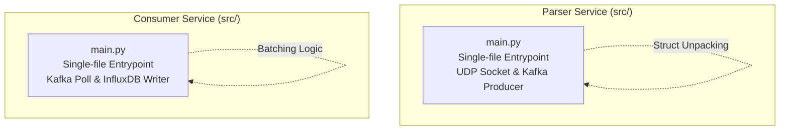

# Referencia: Arquitectura del Código Fuente

Este documento describe la estructura interna de los servicios de Python (`parser` y `consumer`). Está dirigido a desarrolladores que deseen modificar la lógica interna, inyectar nuevas dependencias o realizar pruebas unitarias.

## Diagrama de Componentes C4 (Contenedores Python)



## 1. El Servicio `parser`

El Parser está diseñado para maximizar el throughput. Debido a esto, **no** utiliza librerías asíncronas como `asyncio` para la lectura del socket. La cabecera del sistema operativo (C Socket) es bloqueante y más rápida en su forma procedural básica para UDP local.

### Estructura de Archivos:
```
parser/
├── src/
│   └── main.py            # Bucle infinito UDP, unpacking de structs y Productor Kafka.
├── requirements.txt       # kafka-python
└── Dockerfile
```

> [!NOTE]
> A diferencia de versiones anteriores, toda la lógica del parser (offsets de `struct`, mapeos y la instancia del productor de Kafka) se ha consolidado en un único archivo `main.py` para facilitar la lectura del script de bajo nivel y evitar saltos de contexto al hacer depuración binaria.

### El dilema del JSON Serializer
Por defecto, la función `json.dumps()` de Python es rápida, pero en volúmenes masivos (20k req/min) puede consumir mucha CPU. Para futuras optimizaciones, se recomienda reemplazar el módulo estándar por `orjson` u `ujson` si se nota cuello de botella.

## 2. El Servicio `consumer`

El Consumer es el puente final hacia InfluxDB. Se rige por un bucle de *polling* que extrae mensajes de Redpanda.

### Estructura de Archivos:
```
consumer/
├── src/
│   └── main.py            # Polling de Kafka, manejo de intentos (restarts) y escritura en InfluxDB.
├── requirements.txt       # kafka-python, influxdb-client
└── Dockerfile
```

> [!NOTE]
> La lógica del consumer se encuentra en un único archivo `main.py`. Este archivo incluye el seguimiento de intentos (`session_attempts`) que añade el sufijo `-A2` al `session_uid` en caso de detectar un reinicio (recesión de número de vuelta).

### Inyección del Cliente InfluxDB
La SDK oficial `influxdb-client` tiene soporte nativo para *Batching* (agrupamiento) asíncrono. Esto significa que cuando el Consumer llama a `write_api.write(bucket, org, point)`, la librería no hace un HTTP POST inmediato. En su lugar, guarda el punto en memoria y hace un POST masivo cada X milisegundos o cuando junta 5000 puntos. 

> [!WARNING]
> Nunca uses el modo síncrono completo (`SYNCHRONOUS`) en `influxdb-client` para este proyecto. Forzar una conexión TCP a InfluxDB por cada paquete UDP bloquearía el consumer instantáneamente.
