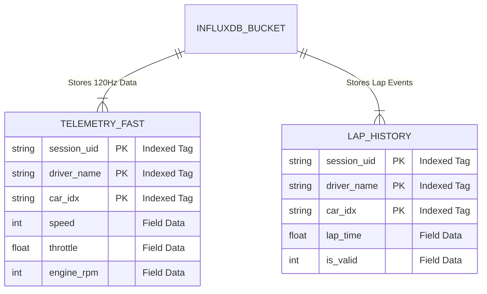

# Referencia y Diccionario de Datos

Este documento sirve como referencia estricta técnica sobre cómo se codifican, procesan y almacenan los datos dentro del pipeline.

## 1. Mapeo de Paquetes (Parser -> Redpanda)

El F1 Parser lee paquetes UDP y los clasifica por la constante de la cabecera `packet_id`.

| Packet ID | Nombre F1 Oficial | Tópico Kafka | Evento de Emisión | Función Python |
| :---: | :--- | :--- | :--- | :--- |
| `0` | Motion | `f1-motion` | 60Hz (Frecuencia alta) | `parse_motion_packet` |
| `2` | Lap Data | `f1-lap-data` | Al cambiar de vuelta/sector | `parse_lap_packet` |
| `4` | Participants | `f1-session-metadata` | Inicio de sesión | `parse_participants_packet` |
| `6` | Car Telemetry | `f1-telemetry-fast` | 60Hz - 120Hz | `parse_telemetry_packet` |
| `7` | Car Status | `f1-race-status` | 2Hz | `parse_status_packet` |
| `11` | Session History | `f1-session-history` | Al finalizar la vuelta | `parse_session_history_packet` |

## 2. Esquema InfluxDB (Line Protocol)

Los datos se escriben en el bucket de forma asíncrona usando la API Sincrónica configurada en el `consumer`. Todos los Measurements comparten tags principales para facilitar el uso de los paneles de Grafana a través de variables (`$driver_name`).

### Tags Universales
- `session_uid` (String): ID único de la sesión que corre el juego. Permite separar carreras distintas en bases de datos históricas. **Atención:** Si el `consumer` detecta un reinicio de sesión (Restart), se le anexará dinámicamente un sufijo al final del string (ej. `123456789-A2`, `123456789-A3`) para evitar que las telemetrías y vueltas se solapen.
- `driver_name` (String): El nombre del piloto decodificado del Participant Packet.
- `car_idx` (String): Índice numérico interno (0-21) usado por el juego.
- `is_player` (String): "true" o "false", indica si la telemetría es del auto manejado por el usuario o de la IA/Multijugador.

### Measurement: `telemetry_fast` (Desde paquete 6)
Fields:
- `speed` (Int): km/h.
- `throttle` / `brake` (Float): 0.0 a 1.0.
- `gear` (Int): -1=Reversa, 0=Neutro, 1-8=Marchas.
- `engine_rpm` (Int): Revoluciones por minuto.
- Temperaturas de neumático superficie: `tyre_temp_surf_rl`, `_rr`, `_fl`, `_fr` (Int)
- Temperaturas de frenos: `brake_temp_rl`, `_rr`, `_fl`, `_fr` (Int)

### Measurement: `lap_history` (Desde paquete 11)
Fields:
- `lap_time` / `sector1_time` / `sector2_time` / `sector3_time` (Float): Segundos (Conversión de milisegundos a segundos realizada en Consumer).
- `is_valid` (Int): Bandera de la FIA (0 o 1) donde 1 significa que el tiempo de vuelta no fue invalidado por límites de pista.

## 3. Manejo de Errores e Hilos
- **Redpanda over-provisioning**: Se arranca el broker con la flag `--overprovisioned` para evitar crashers en equipos de pocos recursos.
- **Deducción de Tiempos**: En el paquete 2, los tiempos se envían fragmentados y sin S3 calculado en algunos casos, por lo que el `parser` infiere el sector 3 restando el tiempo de la vuelta (last_lap_ms) menos S1 y S2 de ser necesario.
