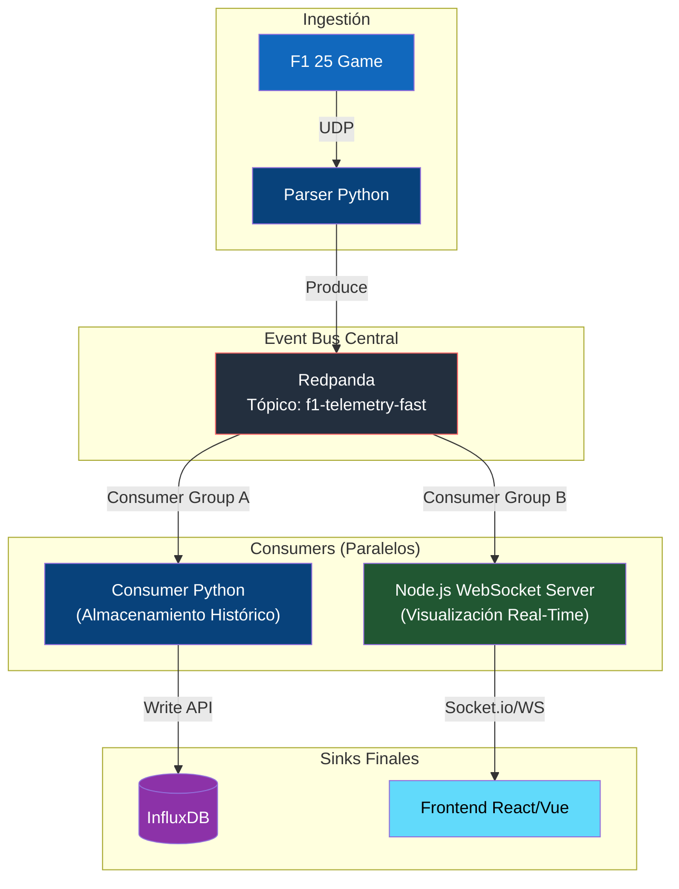

# Tutorial (Avanzado): Escalabilidad y WebSockets

> [!NOTE]
> Uno de los mayores beneficios de la arquitectura introducida (Redpanda/Kafka como buffer central) es que el patrón *Pub/Sub* permite enganchar múltiples "suscriptores" a la telemetría simultáneamente, sin afectar el rendimiento de los demás ni sobrecargar al juego F1 25.

Este tutorial teórico explica cómo escalar el pipeline actual para soportar una visualización personalizada web en tiempo real (Ej. un Dashboard en React) sin usar Grafana.

## La Arquitectura Proyectada

Actualmente, solo el `Consumer (Python)` escucha los mensajes JSON. Para alimentar una web con un retraso cercano a cero milisegundos, podemos construir un microservicio rápido en **Node.js** que actúe como un segundo Consumer, y emita los datos por **WebSockets**.



## Paso a Paso (Conceptual)

1. **Mantener grupos distintos (Consumer Groups)**:
   Al usar Kafka/Redpanda, debes asegurarte de que el servicio Node.js y el servicio Python tengan distinto `group.id` (Ej: `influx-writer-group` y `websocket-emitter-group`). Esto garantiza que *ambos* servicios reciban una copia exacta de todos los mensajes de telemetría.

2. **Crear el Microservicio Node.js**:
   Usarías librerías como `kafkajs` y `socket.io`.
   ```javascript
   const { Kafka } = require('kafkajs');
   const io = require('socket.io')(server);

   const kafka = new Kafka({ clientId: 'f1-ws', brokers: ['redpanda:9092'] });
   const consumer = kafka.consumer({ groupId: 'websocket-emitter-group' });

   await consumer.connect();
   await consumer.subscribe({ topic: 'f1-telemetry-fast', fromBeginning: false });

   await consumer.run({
     eachMessage: async ({ message }) => {
       const telemetry = JSON.parse(message.value.toString());
       // Emitir directamente al frontend conectado
       io.emit('telemetry_update', telemetry);
     },
   });
   ```

3. **Rate Limiting**:
   El paquete de telemetría del F1 viaja a 120Hz (120 mensajes por segundo). Enviar 120 eventos de WebSocket por segundo colapsaría un navegador web común. El servicio Node.js debería aplicar un pequeño *throttle* o promediar los datos para emitirlos a 30Hz o 60Hz.

## ¿Qué ganamos?

- **Cero Modificaciones**: No hemos tenido que tocar ni una sola línea de código del Parser de Python. Él sigue haciendo su trabajo, ciego a cuántos servicios escuchan.
- **Desacople Real**: Si el frontend de React se cae o el servidor de WebSockets crashea, InfluxDB seguirá guardando toda la historia de la carrera sin enterarse.
